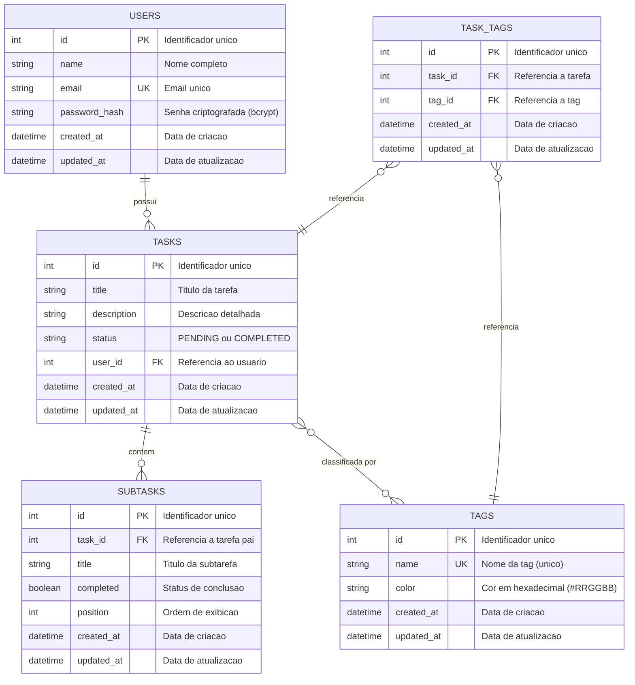

# Modelo de Entidade e Relacionamento

## Diagrama ER

## Relacionamentos

- Um USUARIO pode ter zero ou varias TAREFAS (1:N)
- Uma TAREFA pertence a exatamente um USUARIO
- Uma TAREFA pode ter zero ou varias SUBTAREFAS (1:N)
- Uma SUBTAREFA pertence a exatamente uma TAREFA
- Uma TAREFA pode ter zero ou varias TAGS (N:N)
- Uma TAG pode estar associada a zero ou varias TAREFAS (N:N)
- TASK_TAGS é a tabela junction do relacionamento N:N entre TASKS e TAGS
- Integridade referencial com exclusao em cascata em todos os relacionamentos

## Constraints e Regras

### USERS
- `id`: PRIMARY KEY, AUTO_INCREMENT
- `email`: UNIQUE, NOT NULL
- `name`: NOT NULL
- `password_hash`: NOT NULL
- `created_at`: NOT NULL, DEFAULT CURRENT_TIMESTAMP
- `updated_at`: NOT NULL, DEFAULT CURRENT_TIMESTAMP

### TASKS
- `id`: PRIMARY KEY, AUTO_INCREMENT
- `title`: NOT NULL
- `description`: NOT NULL
- `status`: NOT NULL, DEFAULT 'PENDING', VALUES ('PENDING', 'COMPLETED')
- `user_id`: FOREIGN KEY REFERENCES users(id) ON DELETE CASCADE
- `created_at`: NOT NULL, DEFAULT CURRENT_TIMESTAMP
- `updated_at`: NOT NULL, DEFAULT CURRENT_TIMESTAMP

### TAGS
- `id`: PRIMARY KEY, AUTO_INCREMENT
- `name`: UNIQUE, NOT NULL
- `color`: DEFAULT '#3B82F6' (azul), formato #RRGGBB
- `created_at`: NOT NULL, DEFAULT CURRENT_TIMESTAMP
- `updated_at`: NOT NULL, DEFAULT CURRENT_TIMESTAMP

### TASK_TAGS
- `id`: PRIMARY KEY, AUTO_INCREMENT
- `task_id`: FOREIGN KEY REFERENCES tasks(id) ON DELETE CASCADE
- `tag_id`: FOREIGN KEY REFERENCES tags(id) ON DELETE CASCADE
- `created_at`: NOT NULL, DEFAULT CURRENT_TIMESTAMP
- `updated_at`: NOT NULL, DEFAULT CURRENT_TIMESTAMP
- UNIQUE constraint em (task_id, tag_id) para evitar duplicatas

### SUBTASKS
- `id`: PRIMARY KEY, AUTO_INCREMENT
- `task_id`: FOREIGN KEY REFERENCES tasks(id) ON DELETE CASCADE
- `title`: NOT NULL
- `completed`: NOT NULL, DEFAULT 0 (false)
- `position`: NOT NULL, DEFAULT 0 (para ordenacao)
- `created_at`: NOT NULL, DEFAULT CURRENT_TIMESTAMP
- `updated_at`: NOT NULL, DEFAULT CURRENT_TIMESTAMP

## Indices

- `users.email` UNIQUE
- `tasks.user_id` (indice para listar tarefas por usuario)
- `task_tags.task_id` (indice para buscar tags de uma tarefa)
- `task_tags.tag_id` (indice para buscar tarefas de uma tag)
- `task_tags(task_id, tag_id)` UNIQUE (evita duplicatas)
- `subtasks.task_id` (indice para listar subtarefas de uma tarefa)

## Observacoes

- O status de TASKS e controlado na aplicacao com validacao (PENDING ou COMPLETED).
- O campo color em TAGS aceita formato hexadecimal (#RRGGBB), validado pela aplicacao.
- SUBTASKS usa campo `position` para permitir ordenacao customizada.
- TASK_TAGS implementa relacionamento N:N: uma tarefa pode ter multiplas tags e uma tag pode estar em multiplas tarefas.
