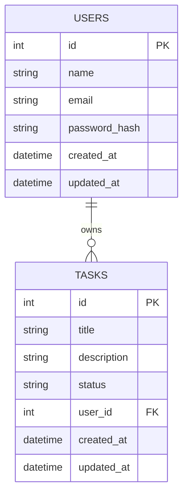

# ER Diagram

```mermaid
erDiagram
  USERS ||--o{ TASKS : owns

  USERS {
    int id PK
    string name
    string email
    string password_hash
    datetime created_at
    datetime updated_at
  }

  TASKS {
    int id PK
    string title
    string description
    string status
    int user_id FK
    datetime created_at
    datetime updated_at
  }
```
