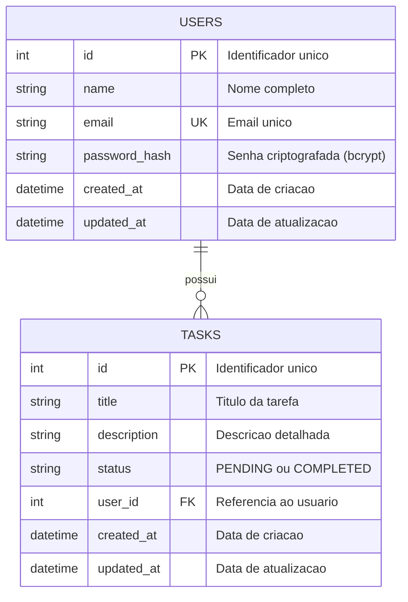

# Modelo de Entidade e Relacionamento

## Diagrama ER

## Relacionamentos

- Um USUARIO pode ter zero ou varias TAREFAS (1:N)
- Uma TAREFA pertence a exatamente um USUARIO

## Constraints

### USERS
- `id`: PRIMARY KEY, AUTO_INCREMENT
- `email`: UNIQUE, NOT NULL
- `name`: NOT NULL
- `password_hash`: NOT NULL

### TASKS
- `id`: PRIMARY KEY, AUTO_INCREMENT
- `title`: NOT NULL
- `description`: NOT NULL
- `status`: NOT NULL, DEFAULT 'PENDING', VALUES ('PENDING', 'COMPLETED')
- `user_id`: FOREIGN KEY REFERENCES users(id) ON DELETE CASCADE
